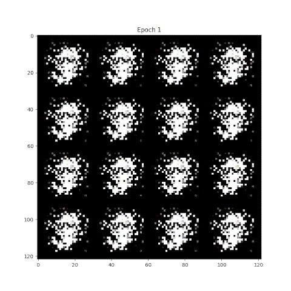

# how-to-gan

Experiments with GANs in PyTorch following the papers [*Generative Adversarial Networks*](https://arxiv.org/abs/1406.2661) and [*Unsupervised Representation Learning with Deep Convolutional Generative Adversarial Networks*](https://arxiv.org/abs/1511.06434).

## Learning the normal distribution with multilayer perceptrons (MLPs)

An implementation of the pedagogical explanation of the GAN training algorithm presented in [*Generative Adversarial Networks*](https://arxiv.org/abs/1406.2661).

```py
python gan_normal.py
```


While the generator does manage to approach the real distribution, training is unstable and very hyperparameter sensitive. For me, this is a good example of a simple toy problem that works in theory but in practice ends up not working as expected. GANs seem to do fine with high-dimensional data like images but struggle to learn clean low-dimensional data like a normal distribution. There are a number of other implementations that reach similar results, offer possible explanations, and ways to improve:

- [Generative Adversarial Networks by Andrej Karpathy](https://cs.stanford.edu/people/karpathy/gan/)
- [Generative Adversarial Nets in TensorFlow](http://blog.aylien.com/introduction-generative-adversarial-networks-code-tensorflow/)
- [An introduction to Generative Adversarial Networks](https://blog.evjang.com/2016/06/generative-adversarial-nets-in.html)
- [Generative Adversarial Networks (GANs) in 50 lines of code (PyTorch)](https://medium.com/@devnag/generative-adversarial-networks-gans-in-50-lines-of-code-pytorch-e81b79659e3f)

## MLPs on MNIST

Multilayer perceptron discriminator and generator based on [*Generative Adversarial Networks*](https://arxiv.org/abs/1406.2661) trained on the MNIST dataset.

```py
python gan_mnist.py
```



Training is fairly stable and the results are visually comparable to the ones presented in the paper.

## Convolutional networks on CIFAR-10

Convolutional discriminator and generator based on [*Generative Adversarial Networks*](https://arxiv.org/abs/1406.2661) trained on the CIFAR-10 dataset.

```py
python gan_cifar10_conv.py
```


Training is fairly stable and the results are visually comparable to the ones presented in the paper.

## DCGAN on CIFAR-10

DCGAN implementation based on [*Unsupervised Representation Learning with Deep Convolutional Generative Adversarial Networks*](https://arxiv.org/abs/1511.06434) trained on the CIFAR-10 dataset.

```py
python dcgan_cifar10.py
```


Training is very stable and the results are visually comparable to the ones presented in the paper.

## Installation

### Dependencies
- Python 3
- pip

### Installation
1. Clone the repository
   ```
   git clone https://github.com/davidtvs/how-to-gan.git
   ```
2. Install package requirements:
   ```
   pip install -r requirements.txt
   ```
